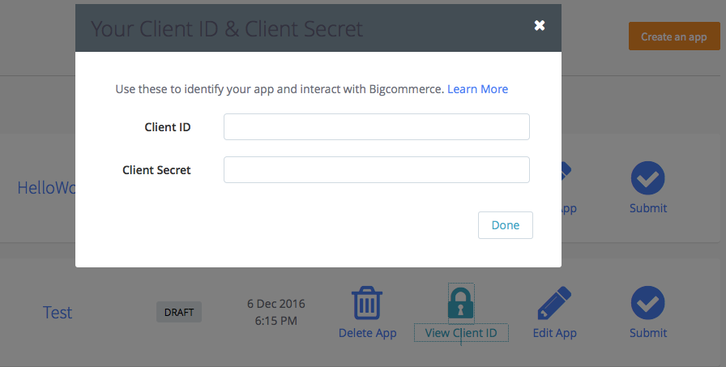

#  API/Apps First Steps 

The following sections list initial steps for two different development scenarios:

* Developing private apps for a particular BigCommerce store: You can follow the [Apps Quick Start](#apicred) procedure, which has no administrative requirements.

* Developing <a href="https://www.bigcommerce.com/single-click-apps/" target="_blank">Single-Click Apps</a> for sale to/installation on any BigCommerce store. for a particular BigCommerce store: See the [Joining the BigCommerce App Marketplace](#joinappmkt) procedure, which requires applying to become a BigCommerce partner.

These two scenarios are not mutually exclusive – some developers will work under both scenarios – but some of their instructions are redundant. Please use the links above to jump to the section that best matches your immediate scenario.

#  Apps Quick Start: Obtaining API Credentials

<aside class="notice">
 Private or Saleable Apps?   
This section is intended for developers who want to immediately start developing and testing private apps for a particular store.   If your ultimate goal is to distribute apps on the BigCommerce Apps Marketplace, you can avoid repeated steps (like creating trial/sandbox stores for app testing) by jumping directly to the instructions under <a href="#joinappmkt">Joining the BigCommerce App Marketplace</a>.
</aside>

To obtain Basic or OAuth credentials to use this API, you will first need to create a trial store. (If you already have a store, skip ahead to [Logging&#160;In](#login).)

##  Creating a Trial Store

1. Go to the <a href="https://www.bigcommerce.com" target ="_blank">BigCommerce home page</a>.

2. Select either **GET STARTED** or **START YOUR FREE TRIAL**.

3. Enter an email address where prompted, and select **START YOUR TRIAL**.

4. In the trial store form, enter a store name, password, and other details. Then select **CREATE YOUR STORE**.

5. Wait for the store-creation animation to stop, then select either **FINISH** or **Ask Me Later**.

##  Logging In

If you have just created your trial store, you will already be logged into the store's control panel. Skip ahead to [Creating Basic Auth Credentials](#basiccred).

Otherwise, you might need to log into your store:

1. Return to the <a href="https://www.bigcommerce.com" target ="_blank">BigCommerce home page</a>.

2. Select **LOG IN** at the upper right. 

3. If prompted to **Log in to your store**, enter the email address and password you set when you created  your trial, then select **LOG IN**.

    This will reopen your store's control panel.

##  Creating Basic Auth Credentials 

1. From your store's control panel, go to **Advanced Settings > Legacy API Settings**.

2. Select **Create a Legacy API Account**.

3. Enter a **Username**. Reusing the app's name is a good way to keep track of which account corresponds to which app. After saving, you can use the API credentials listed on this page.
4. Select **Save** if you're creating or changing the API account.

##  Creating OAuth Credentials

When you log in to the BigCommerce Developer Portal to get OAuth credentials for the first time, you'll be prompted to authorize the Developer Portal application.

1. Select **My Apps** in this Developer Portals's upper-right-hand corner, and log in to your BigCommerce account.
2. Within the Developer Portal, select **Create an app**. You can give your app any name you'd like, such as `Test`.
3. Once the app is created, select **View Client ID**. This will display the modal shown below, from which you can copy your   **Client ID** and **Client Secret**.

## Making an API Request

Many tools are available to interact with APIs. For example, to see how to quickly make initial requests using <a href="https://en.wikipedia.org/wiki/CURL" target="_blank">cURL</a> commands, please see our [cURL Quickstart Guide](#curl-quickstart-guide).

#  Joining the BigCommerce App Marketplace

 Build Best-Of-Breed Solutions for Fast-Growing Online Businesses 

The following sections outline the steps required to become a vendor of <a href="https://www.bigcommerce.com/single-click-apps/" target="_blank">Single-Click Apps</a> on the BigCommerce platform.

<aside class="notice">
 Want a Quicker Start?   
If you only want to develop private apps for a particular BigCommerce store, you can get started faster by jumping to the streamlined instructions under <a href="#apicred">Apps Quick Start</a>.
</aside>

##  Apply to the Technology Partner Program 

Before you can submit an app to the BigCommerce Marketplace, you must become an official Partner. BigCommerce offers app developers free sandbox stores through its Technology Partner Program. You can <a href="https://www.bigcommerce.com/partners/signup" target="_blank">apply for a technology partnership here</a>. To be approved as a partner, you will need:

* A website.
* Intent to offer your app publicly.
* Ability to support users of your app.
* Evidence of expertise in app development.

<aside class="notice">
Notes 
  <ul>
	<li>If you are an existing BigCommerce partner, you do <em>not</em> need to re-apply for the Technology Partner Program.</li>
	<li>The email address you use in the partnership application form must be the same email address as you use to log into your sandbox store, and to log into <a href="//devtools.bigcommerce.com" target="_blank">My&#160;Apps</a>.</li>
  </ul>
</aside>

Once approved, you will receive one or more emails listing your partner credentials and next steps. Your Partner username and ID will be required to submit your app for <a href="https://developer.bigcommerce.com/" target="_blank">App Store</a> consideration.

<aside class="notice">
Note
 
  <ul>
	<li>If you do not receive these credentials by email, please contact <a href="mailto:appstore@bigcommerce.com">appstore@bigcommerce.com</a>.
	</li>
  </ul>
</aside>

##  Create a Sandbox Store 

To open your sandbox store, log into the Partner Portal, then click **Create a Trial Store**. 

When you log into your new store, use the same email that you used when applying to become a Technology Partner.

NOTE: Although the **Create a Trial Store** option's name indicates that the store might be temporary, it is actually permanent.

##  Create Your Draft App 

Once you’re ready to start on your app, navigate to the Developer Portal home page, select the **My Apps** link, and log in using the same email address you've used for your sandbox store.

The **My Apps** page is where you will add, edit, and manage any of your BigCommerce Single-Click Apps. Start by clicking **Create an app**, and initiating <a href="/api/#app-registration">registration of your app</a>. (You can always come back to edit your draft app's name and other details later.)

Once your draft app is created, you will be able to install and test it privately in your sandbox store.
 
<aside class="notice">
Note
	  
To access your draft app in the store, make sure the email address you enter for your sandbox store’s **Owner** is identical to the email address you use for the BigCommerce Developer Portal. </ul>
</aside>

##  Submit Your App 

Once your app is fully functional, and meets all of BigCommerce’s <a href="#app-store-approval-requirements">approval requirements</a>, submit the app from **My Apps**. We will get back to you as soon as we have reviewed your submission.

##  About Client Libraries 

To make facilitate app development on the BigCommerce platform, we provide [client libraries](#client-libraries) in a variety of popular programming languages.