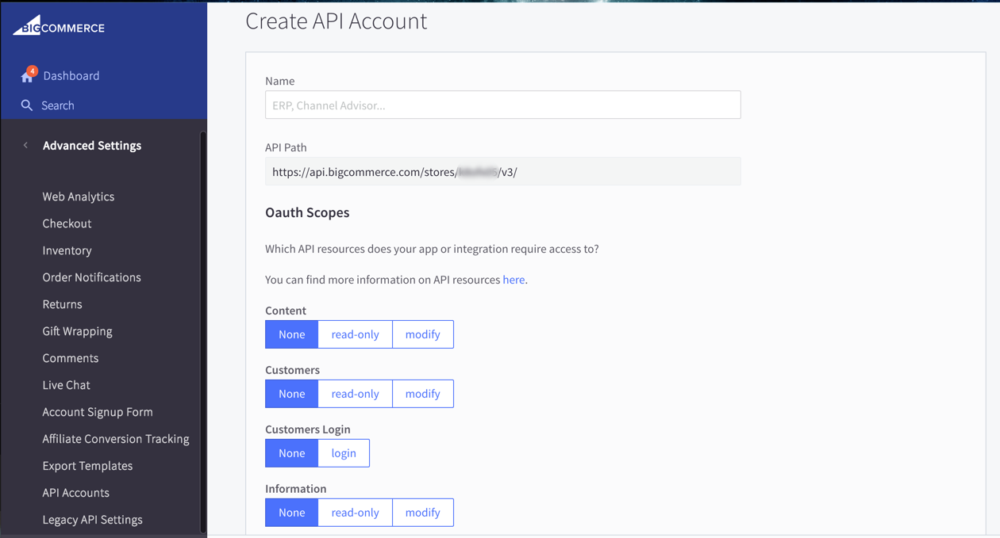
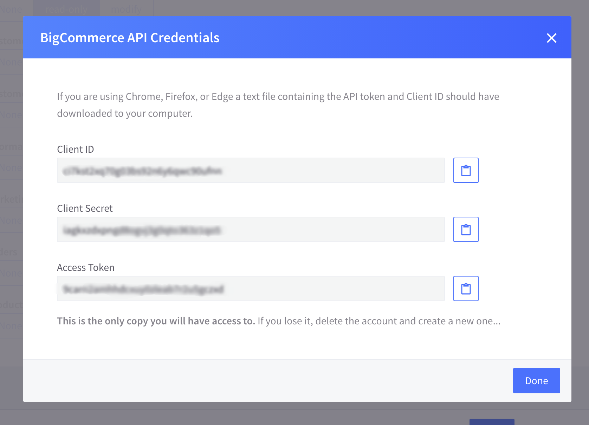
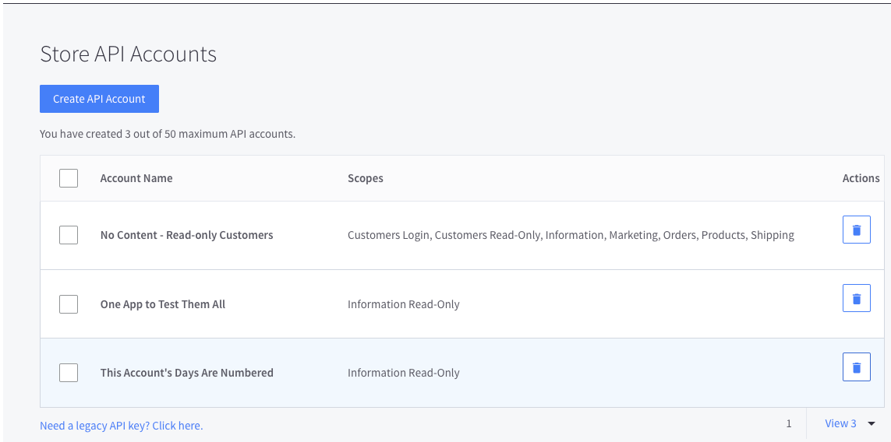

#  Managing API Credentials

You have two options for obtaining and managing credentials that will connect your app with your BigCommerce store:

* [Obtaining OAuth Tokens](#cp_oauth_get): We recommend OAuth, because this authentication method is compatible with all current and planned BigCommerce APIs. Also, OAuth is required for apps intended to be [sold on the BigCommerce App Marketplace](#).

* [Creating Basic Auth Credentials](#basiccred): Basic Auth is still supported as a legacy option for [private apps](##building-basic-auth-apps) (apps developed for a single BigCommerce store). However, although Basic Auth is compatible with most of our v2 API, it is inccompatible with [webhooks](##webhooks-overview), and incompatible with our <a href="https://github.com/bigcommerce/api/blob/master/docs/v3-catalog.md" target="_blank">v3 API</a>.

##  Authenticating with OAuth 

The following sections outline how to create and manage OAuth tokens in the BigCommerce control panel.

<aside class="success">
 Future-Proof with OAuth   
We strongly recommend that you build all BigCommerce apps using OAuth. OAuth is compatible with all current and planned BigCommerce APIs, including v2 Webhooks and our v3 API. Also, any apps intended for sale on the BigCommerce App Marketplace must use OAuth. BigCommerce is gradually deprecating its legacy support for <a href="#basiccred">Basic Authentication</a>.
</aside>

###  Obtaining OAuth Tokens 

You can create and manage OAuth tokens in the BigCommerce control panel by creating an API account, as described below. (Only the <a href="https://support.bigcommerce.com/articles/Public/Store-Owner" target="_blank">store&#160;owner</a> can create API accounts; accounts are limited to 50 per store.) 

To create your API account and its corresponding token, use the following steps:

1.  Log into the store, using the store owner's username/password.
2.  Select **Advanced Settings**.
3.  Select **API Accounts**. This will display the **Store API Accounts** page.
4.  Select **Create API Account**. This will display the **Create API Account** page shown above.
5.  In the **Name** field, summarize the purpose for which you will use these credentials. (This name is for internal use only, so assign any name that you will recognize.)
6.  Copy the **API Path** field's contents and save it to a file. You will need this path to interact with the API. (If you need to later re-create this string, it is made up of: `https://api.bigcommerce.com/stores/` + `<your store hash>` + either `/v3/` or `/v2/`, depending on the API version you are targeting.)
7.  In the **OAuth Scopes** section, select at least the minimal scopes your app will require (as explained <a href="#request_scopes" target="_blank">here</a>). 
8.  Select **Save** at the page's lower right-hand corner.

A successful save will display the pop-up shown below, containing the API credentials that your app will need for OAuth access – your **Client ID**, **Client Secret**, and **Access&#160;Token**. Also, a .txt file containing the same credentials will (on most browsers) download to your computer.

<aside class="warning">
Keep Your Credentials  
There is no way to re-display this pop-up after you select <b>Done</b> to dismiss it.    
So make sure you store your credentials &ndash; either by copying/pasting the contents of each field out of the pop-up, or by keeping the downloaded .txt file. (To that same .txt file, we suggest adding the **API Path** field value that your stored earlier.) Otherwise, you will need to repeat all the above steps to generate new credentials.
</aside>

###  Revoking an OAuth Token 

To revoke an OAuth token, use the following steps to delete the associated API account:

1.  Log into the store, using the store owner's username/password.
2.  Select **Advanced Settings**.
3.  Select **API Accounts**. This will display the **Store API Accounts** page, shown below.
4.  In the **Actions** column at right, select the trash-can button next to the account you want to delete.

<aside class="warning">
Delete Carefully  
There is no undo, so be sure before you delete an account. You can also use the check boxes on the left side to delete multiple accounts at once &ndash; but be especially careful when using this option.
</aside>

###  OAuth API Requests 

To see how to quickly make initial OAuth requests using the <a href="https://www.getpostman.com/" target="_blank">Postman app</a>, please see our [Postman/OAuth Quickstart Guide](#postman_qs).
