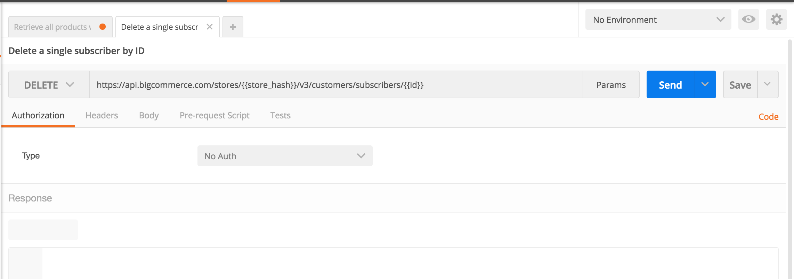
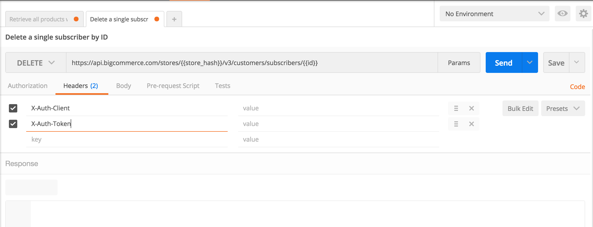

#  Postman/OAuth Quickstart Guide 

This section shows you how to quickly get started exercising BigCommerce APIs, using the <a href="https://www.getpostman.com/" target="_blank">Postman app</a>.

To get started, you'll need OAuth credentials to supply to Postman. BigCommerce uses OAuth 2.0. 

##  Creating OAuth2.0 Credentials 

Create your OAuth 2.0 credentials as described above under [Obtaining OAuth Tokens](/api#cp_oauth_get). (Depending on what scopes you set, you will be limited in what objects you can request. You can view scope information [here](/api#oauth-scopes).)

##  Postman Setup 

You'll do the next steps in the Postman app.

###  Select No Auth 

In Postman, set the **Type** drop-down list to **No Auth** (so as to create only the OAuth headers that you need). This will display the form shown below:

###  Populate Auth Headers 

Select the **Headers** tab to display the form shown below: 

Next, add these two key/value pairs, using the OAuth credentials you obtained in the BigCommerce control panel:

| Key | Value |
|---|---|
| `X-Auth-Client` | The **Client ID** you obtained when you [created your OAuth token](/api#cp_oauth_get). |
| `X-Auth-Token` | The **Access Token** string you obtained when you [created your OAuth token](/api#cp_oauth_get). |

##  Sending a Request 

We have created a collection of Postman requests for our v3 API, which you can import by clicking the button below:

To use this collection, you'll need to enter your OAuth credentials, as explained above under [Postman Setup](#post_setup).
 
You'll also need to enter your store's API Path, as displayed in the [control panel](/api#cp_oauth_get). You can do so in either of these days:

* Within each endpoint, replace the variable `{{store_hash}}`; or 

* Add a new environment, in which you create a  `store_hash` key, then set its value to the alpahnumeric string from your API Path. (For&#160;details on setting up a Postman environment, see [this Postman documentation](https://www.getpostman.com/docs/environments).)

Now you can send and receive information through an OAuth API connection with BigCommerce. If you'd like to register webhooks through Postman, please see [Creating Webhooks: Sending the POST Request](/api#creating-webhooks-sending-the-post-request). 

