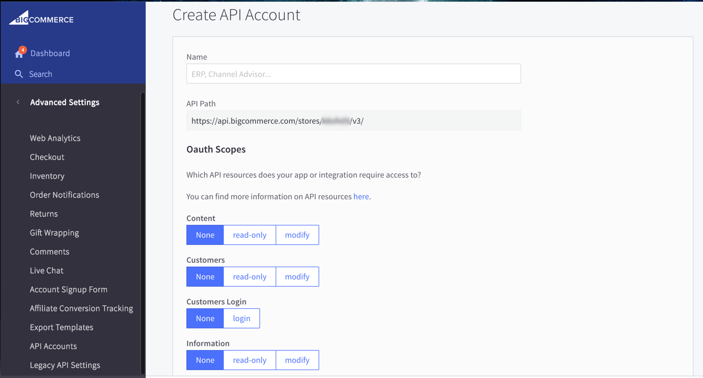

##  Using Postman with OAuth 

To get started, you'll need OAuth credentials to supply to Postman. BigCommerce uses OAuth 2.0. 

###  Creating OAuth2.0 Credentials 

<aside class="warning">
Dupe Dee Dupe Dupe  
Except for the final note & link re: scopes, this whole section + pix can become a link to the new section on creating OAuth tokens in the cp: [here](#cp_oauth_get) (Where I bogarted your pix and expanded the procedural info.) Plus a note to keep the credentials you obtained there.
</aside>

<strike>
1. Log in to your store as a **store owner**
2. Go to **Advanced Settings > API Accounts**
3. Click **Create API Account**

####  Selecting Scopes, Client ID, and Client Token 

Enter any name to denote what you will be using these credentials for. This is for your internal use. 

Depending on what scopes you set, you will be limited in what objects you can request (You can view scope information [here](/api/#oauth-scopes).)

Next, click **Save** in the bottom right-hand corner of the screen. A pop-up with your API credentials will appear and a .txt file will download that contains them as well. 

You will only be able to view these once, so keep the .txt file if you believe you will need to enter these credentials multiple times.</strike>

Depending on what scopes you set, you will be limited in what objects you can request (You can view scope information [here](/api/#oauth-scopes).)

###  Postman Setup 

In Postman, set the **Type** drop-down list to **No Auth** (so as to create only the OAuth headers that you need). This will display the form shown below:

Select the **Headers** tab, then add these two key/value pairs, using the OAuth credentials you obtained in the BigCommerce control panel:

| Key | Value |
|---|---|
| `X-Auth-Client` | The **Client ID** you obtained when you [created your OAuth token](/#cp_oauth_get). |
| `X-Auth-Token` | The **Access Token** string you obtained when you [created your OAuth token](#cp_oauth_get). |

###  Sending a Request 

We have created a collection of Postman requests for our v3 API, which you can import by clicking the button below:

To use this collection, you'll need to enter your OAuth credentials, as explained above under [Postman Setup](#post_setup).
 
You'll also need to enter your store's **API Path** as displayed in the [control panel](#cp_oauth_get). You can do so in either of these days:

* Within each endpoint, replace the variable **{{store_hash}}**; or 

* Add a new environment, in which you create a  **store_hash** key, then set its value to the alpahnumeric string from your **API Path**. (For details on setting up a Postman environment, see [this Postman documentation](https://www.getpostman.com/docs/environments).)

Now you can send and receive information through an OAuth API connection with BigCommerce. If you'd like to register webhooks through Postman, please see [Creating Webhooks: Sending the POST Request](/api/#creating-webhooks-sending-the-post-request). 

